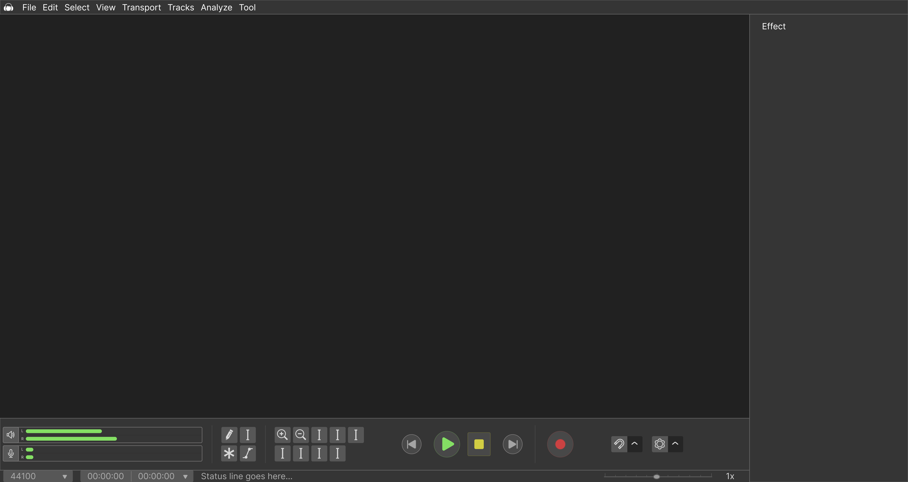

 
=========================

I am working on Audacity UI to make it look bit friendly and visualy likeable. First I will work on dark them and then may be on light also. I will design and also integrate it into Audacity.

This UI is inspired by Blender 3d UI and other UIs that I have seen and developed so far.

Designing UI 2.0 in Figma, take a look at design [**here**](https://www.figma.com/file/Zl4VzHsBkKzrYqkgyVV4Jv/Audacity-UI-2.0?node-id=0%3A1).

""

It will look like this
